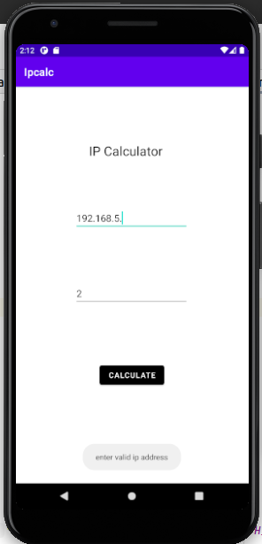
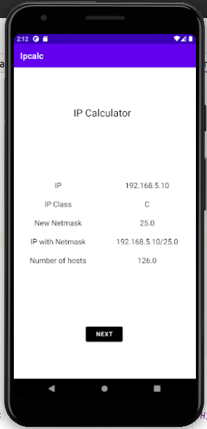
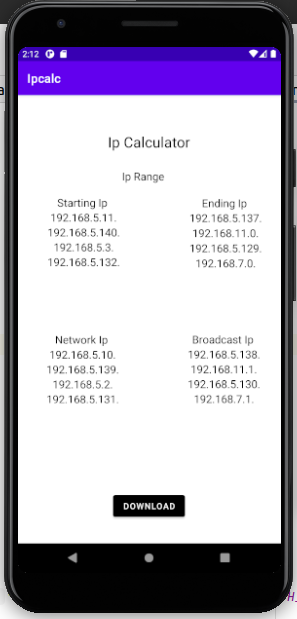
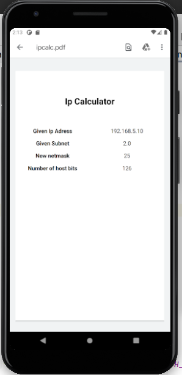

# Ip_Calculator

To view the demo - https://drive.google.com/file/d/1sOnc8TNvW5pg6spnWfLjeyTxccoWpj30/view?usp=sharing

This android application helps to get the subnet in the given IP address by taking the input as IP address and Number of subnet that user wants in the network

Subentting - A subnetwork or subnet is a logical subdivision of an IP network. The practice of dividing a network into two or more networks is called subnetting. Computers that belong to the same subnet are addressed with an identical most-significant bit-group in their IP addresses.

Screenshots

Taking the user Input

This application calculates the class of IP and new netmask along with the number of hosts allowed in each subnet

It displays the starting IP, ending IP, broadcast IP, Network IP of first 4 subnets.

All the results generated can be saved to device local memory in the PDF form 

#Setup

Android Studio Installation

Linux

Download android studio which fits for your operating system according to version

https://developer.android.com/studio

To install the downloaded file follow following steps in linux

Unpack the .zip file you downloaded to an appropriate location for your applications, such as within /usr/local/ for your user profile, or /opt/ for shared users.

If you're using a 64-bit version of Linux, make sure you first install the required libraries for 64-bit machines.

To launch Android Studio, open a terminal, navigate to the android-studio/bin/ directory, and execute studio.sh.

Select whether you want to import previous Android Studio settings or not, then click OK.

The Android Studio Setup Wizard guides you through the rest of the setup, which includes downloading Android SDK components that are required for development.

Official documentation - https://developer.android.com/studio/install

After Installation download this repository locally import to android studio and you are ready to run the application.

